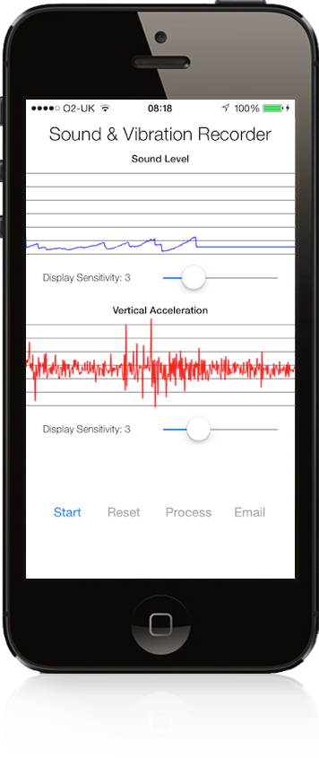
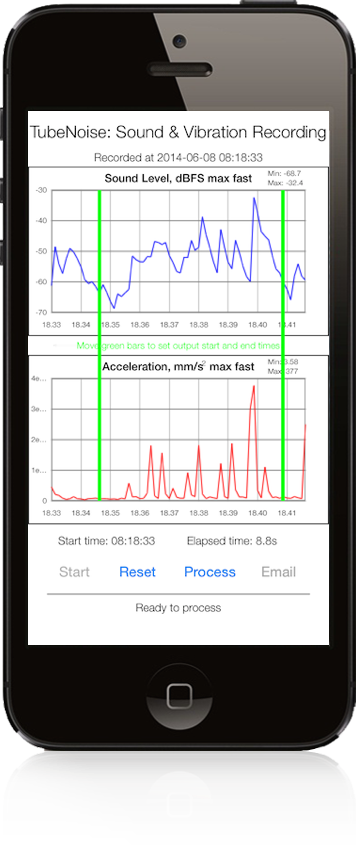
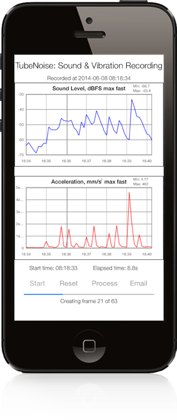
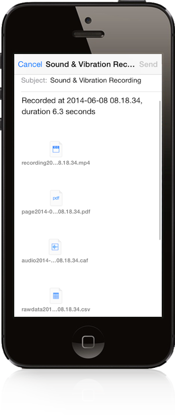

# TubeNoise

TubeNoise - Sound &amp; Vibration Recorder

This code creates a basic sound and vibration recorder for iPhones. It was created to monitor the sound / vibration levels from London Underground trains around Kennington in South London. You can see more at .

Sounds are measured using the iPhone microphone and both the sound level (in dB) and the actual sound are recorded.

Vibrations are measured using the iPhone accelerometer. The z-axis is used for measuring acceleration - so the iPhone should be placed on its back to measure vibration of a surface.

## Features

## Output formats
* mp4 movie with the recorded sound and an animation of the vertical acceleration / sound level recorded
* pdf with the acceleration and sound level plots
* caf audio file of the the recorded sound
* csv files for the unprocessed acceleration / sound values as well as the sampled acceleration / sound values

## Requirements
* iOS 7.0 or later.
* Retina display iPhone (screen size 320 x 568).
* ARC memory management.

## Usage
* Install the code on your iPhone. Note that the simulator won't work as there is no accelerometer.
* Run the code. Adjust the display sensitivity if required. This doesn't change the recording sensitivity.
* Tap 'Start' to start recording and 'Stop' when you're done.
* Slide the green bars if you want to trim the recording start / end time. (Limitation: start time must be between zero and half way through the recording. End time must be between half way through and the end of the movie)
* Tap 'Process' to create the video of the sound / acceleration, then tap 'Email' to send the files.

## License

The MIT License (MIT)

Copyright (c) 2014 Charles Allen

Permission is hereby granted, free of charge, to any person obtaining a copy
of this software and associated documentation files (the "Software"), to deal
in the Software without restriction, including without limitation the rights
to use, copy, modify, merge, publish, distribute, sublicense, and/or sell
copies of the Software, and to permit persons to whom the Software is
furnished to do so, subject to the following conditions:

The above copyright notice and this permission notice shall be included in
all copies or substantial portions of the Software.

THE SOFTWARE IS PROVIDED "AS IS", WITHOUT WARRANTY OF ANY KIND, EXPRESS OR
IMPLIED, INCLUDING BUT NOT LIMITED TO THE WARRANTIES OF MERCHANTABILITY,
FITNESS FOR A PARTICULAR PURPOSE AND NONINFRINGEMENT. IN NO EVENT SHALL THE
AUTHORS OR COPYRIGHT HOLDERS BE LIABLE FOR ANY CLAIM, DAMAGES OR OTHER
LIABILITY, WHETHER IN AN ACTION OF CONTRACT, TORT OR OTHERWISE, ARISING FROM,
OUT OF OR IN CONNECTION WITH THE SOFTWARE OR THE USE OR OTHER DEALINGS IN
THE SOFTWARE.
